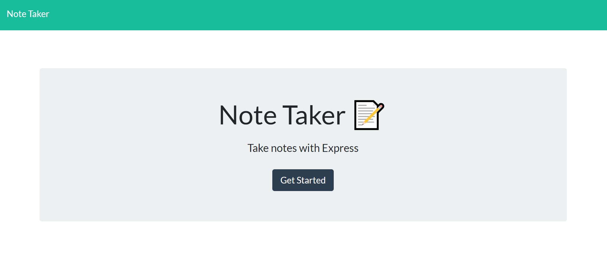
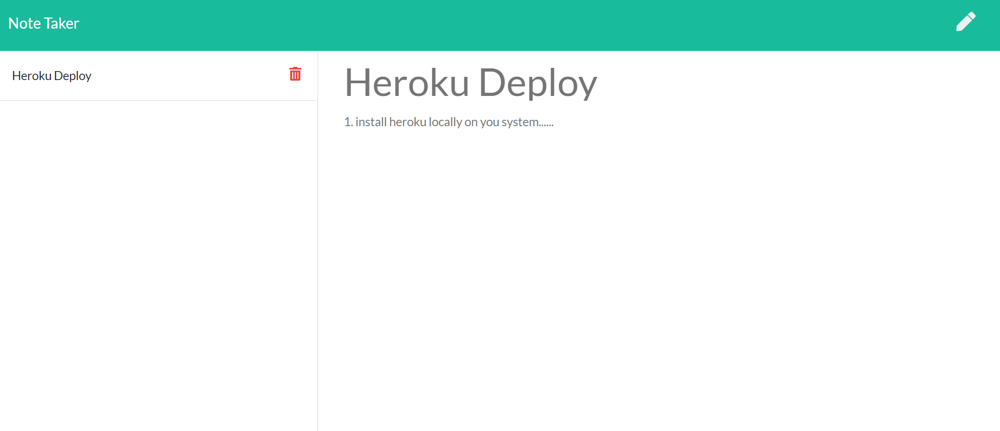

# Note Taker

## Description

Note taker is an application that allows the user to add, save, and delete written notes. The note taker is a very simple and user friendly. People can use this to store information quickly. This is a link to the deployed site [Note Taker](https://agile-bastion-68639.herokuapp.com/).

- This application was written in HTML, CSS, and JS. Also the following libraries were used:

* Node.JS
* A Heroku server
* HTML and API routes
* Express
* JSON
* fs
* Path
* UUID

## Table of Contents

- [Installation](#installation)
- [Usage](#usage)
- [License](#license)
- [Contributing](#contributing)
- [Tests](#tests)
- [Contact](#contact)

## Installation

Copy the link of the repository from the clone button, then run `git clone "the link of the repo"`. Once the repo cloned run the `npm install` to install all dependencies. Node js is required for this project.

## Usage

To start using this app, simply start typing in the **Note Title** and **Note Text** fields. Once your are done with the note hit the save button, and the new note will appear on the side. Click on the pencil button to add a new note.

**This is the landing page**

**The page where the notes can be taken**

## License

Copyright (c) 2021 Alsharif Eid Nahas

MIT License

Permission is hereby granted, free of charge, to any person obtaining a copy
of this software and associated documentation files (the "Software"), to deal
in the Software without restriction, including without limitation the rights
to use, copy, modify, merge, publish, distribute, sublicense, and/or sell
copies of the Software, and to permit persons to whom the Software is
furnished to do so, subject to the following conditions:

The above copyright notice and this permission notice shall be included in all
copies or substantial portions of the Software.

THE SOFTWARE IS PROVIDED "AS IS", WITHOUT WARRANTY OF ANY KIND, EXPRESS OR
IMPLIED, INCLUDING BUT NOT LIMITED TO THE WARRANTIES OF MERCHANTABILITY,
FITNESS FOR A PARTICULAR PURPOSE AND NONINFRINGEMENT. IN NO EVENT SHALL THE
AUTHORS OR COPYRIGHT HOLDERS BE LIABLE FOR ANY CLAIM, DAMAGES OR OTHER
LIABILITY, WHETHER IN AN ACTION OF CONTRACT, TORT OR OTHERWISE, ARISING FROM,
OUT OF OR IN CONNECTION WITH THE SOFTWARE OR THE USE OR OTHER DEALINGS IN THE
SOFTWARE.

## Contributing

No contributions are being accepted at this time.

## Tests

Run `npm test` to run tests via the npm jest package.

## Contact

You can contact me at alsharifeid@gmail.com.  
You can also view my GitHub profile at https://github.com/alsharifnahas

© 2020 Alsharif Nahas. Confidential and Proprietary. All Rights Reserved.
